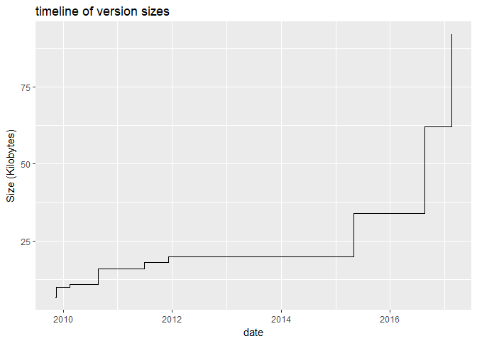
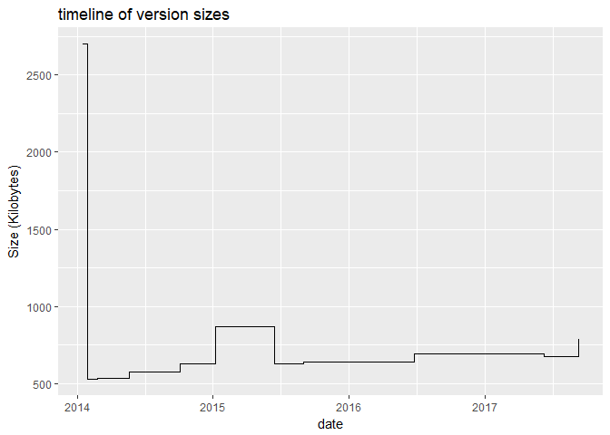
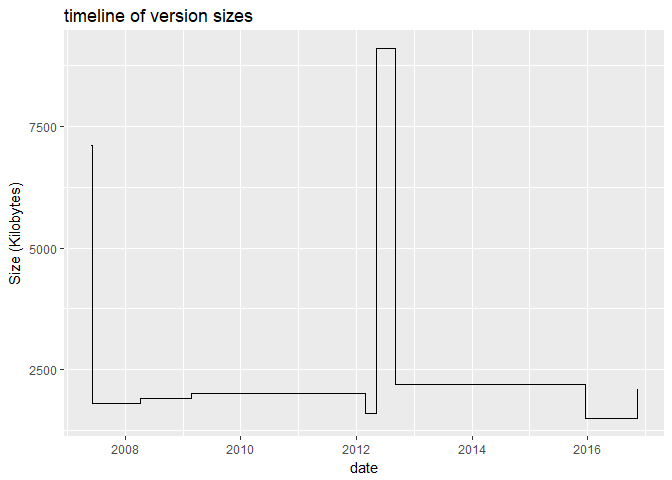
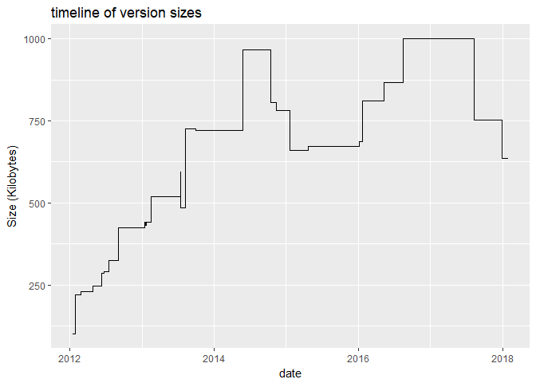

hw04
================
Josh Seo
4/10/2018

``` r
#setwd("C:/Users/SEO/Desktop/Josh/School/UCB/Spring 2018/Stat 133/hw-stat133/hw04")
source('../code/archive-functions.R')
```

    ## 
    ## Attaching package: 'dplyr'

    ## The following objects are masked from 'package:stats':
    ## 
    ##     filter, lag

    ## The following objects are masked from 'package:base':
    ## 
    ##     intersect, setdiff, setequal, union

``` r
knitr::opts_chunk$set(echo = TRUE, error = TRUE, fig.path = '../images/')
```

``` r
raw_data <- read_archive('stringr')
clean_data <- clean_archive(raw_data)
plot_archive(clean_data)
```



``` r
raw_data_dplyr <- read_archive('dplyr')
clean_data_dplyr <- clean_archive(raw_data_dplyr)
plot_archive(clean_data_dplyr)
```



``` r
write.table(clean_archive(raw_data_dplyr), file = "../data/dplyr-archive.csv", 
            sep = ",",
            col.names = TRUE,
            row.names = FALSE)


raw_data_ggplot <- read_archive('ggplot2')
clean_data_ggplot <- clean_archive(raw_data_ggplot)
plot_archive(clean_data_ggplot)
```



``` r
plot_archive(clean_data_ggplot)
```


``` r
write.table(clean_archive(raw_data_ggplot), file = "../data/ggplot-archive.csv", 
            sep = ",",
            col.names = TRUE,
            row.names = FALSE)


raw_data_XML <- read_archive('XML')
```

    ## Error: failed to load external entity "http://cran.r-project.org/src/contrib/Archive/XML"

``` r
clean_data_XML <- clean_archive(raw_data_XML)
```

    ## Error in clean_archive(raw_data_XML): object 'raw_data_XML' not found

``` r
plot_archive(clean_data_XML)
```

    ## Error in ggplot(data = z): object 'clean_data_XML' not found

``` r
plot_archive(clean_data_XML)
```

    ## Error in ggplot(data = z): object 'clean_data_XML' not found

``` r
write.table(clean_archive(raw_data_XML), file = "../data/xml-archive.csv", 
            sep = ",",
            col.names = TRUE,
            row.names = FALSE)
```

    ## Error in clean_archive(raw_data_XML): object 'raw_data_XML' not found

``` r
raw_data_knitr <- read_archive('knitr')
clean_data_knitr <- clean_archive(raw_data_knitr)
plot_archive(clean_data_knitr)
```



``` r
plot_archive(clean_data_knitr)
```


``` r
write.table(clean_archive(raw_data_knitr), file = "../data/knir-archive.csv", 
            sep = ",",
            col.names = TRUE,
            row.names = FALSE)

#merge dataframe
library(ggplot2)
combined_data <-
  rbind.data.frame(clean_data_dplyr, clean_data_ggplot, clean_data_XML, clean_data_knitr)
```

    ## Error in rbind.data.frame(clean_data_dplyr, clean_data_ggplot, clean_data_XML, : object 'clean_data_XML' not found

``` r
#merged plot
ggplot(combined_data, aes(x = date, y = size)) +
  geom_step(aes(col = name)) +
  ggtitle("timeline of version sizes") +
  xlab("date") + ylab("Size (KB)")
```

    ## Error in ggplot(combined_data, aes(x = date, y = size)): object 'combined_data' not found

``` r
#faceted plot
ggplot(combined_data, aes(x = date, y = size)) +
  geom_step(aes(col = name)) +
  facet_wrap(~name, scales="free") +
  ggtitle("timeline of version sizes") +
  xlab("date") + ylab("Size (KB)")
```

    ## Error in ggplot(combined_data, aes(x = date, y = size)): object 'combined_data' not found

``` r
tweet <- read.csv("https://raw.githubusercontent.com/ucb-stat133/stat133-spring-2018/master/data/text-emotion.csv", stringsAsFactors = FALSE)

#count the number of characters per tweet 
chars_per_tweet <- nchar(tweet$content)
summary(chars_per_tweet)
```

    ##    Min. 1st Qu.  Median    Mean 3rd Qu.    Max. 
    ##    1.00   43.00   69.00   73.44  103.00  184.00

``` r
#plot a histogram 
hist(chars_per_tweet,
     main = "Histogram of number of characters in tweet",
     xlab = "Number of Characters",
     col = "lavender",
     xlim = c(0, 200),
     breaks = 50)
```


``` r
library(stringr)
#mention counts and plot
mention <- str_extract_all(tweet$content, '@[\\w]{1,16}[\\w]{1,16}')
mention_count <- sapply(mention, length)
mention_table <- table(mention_count)
mention_table
```

    ## mention_count
    ##     0     1     2     3     4     5     6     7     8     9    10 
    ## 21049 18156   650    85    34    16     5     1     2     1     1

``` r
barplot(mention_table)
```


``` r
#tweet with 10 mentions
i <- which.max(mention_count)
mention[i]
```

    ## [[1]]
    ##  [1] "@Mel_Diesel"     "@vja4041"        "@DemonFactory"  
    ##  [4] "@shawnmcguirt"   "@SEO_Web_Design" "@ChuckSwanson"  
    ##  [7] "@agracing"       "@confidentgolf"  "@tluckow"       
    ## [10] "@legalblonde31"

``` r
#number of hash tags
hash_tags <- str_extract_all(tweet$content, pattern = "#[[:alnum:]]{1,}[[:alnum:]]{1,}")
hash_count <-sapply(hash_tags, length)
hash_table <- table(hash_count)
barplot(hash_table)
```


``` r
mean(hash_count)
```

    ## [1] 0.02265

``` r
#length of hash tags
hash_tags[1]
```

    ## [[1]]
    ## character(0)

``` r
hash_only <- str_replace_all(hash_tags, "[character(0)]", "")
tags_only <- str_replace_all(hash_only, "[#]", "")
hash_length <- nchar(tags_only, type = "chars", allowNA = FALSE)
mean(hash_length)
```

    ## [1] 0.130975

``` r
table(hash_length)
```

    ## hash_length
    ##     0     1     2     3     4     5     6     7     8     9    10    11 
    ## 39240    23   118    89    87    83    68    67    35    32    49    15 
    ##    12    13    14    15    16    17    18    19    20    21    22    23 
    ##    14    16     8     5     8     3     5     5     3     3     7     1 
    ##    24    25    26    27    31    34    35    49    62    70 
    ##     3     1     3     1     1     1     1     1     1     3

``` r
which.max(hash_length)
```

    ## [1] 30930
