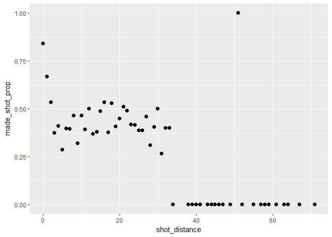
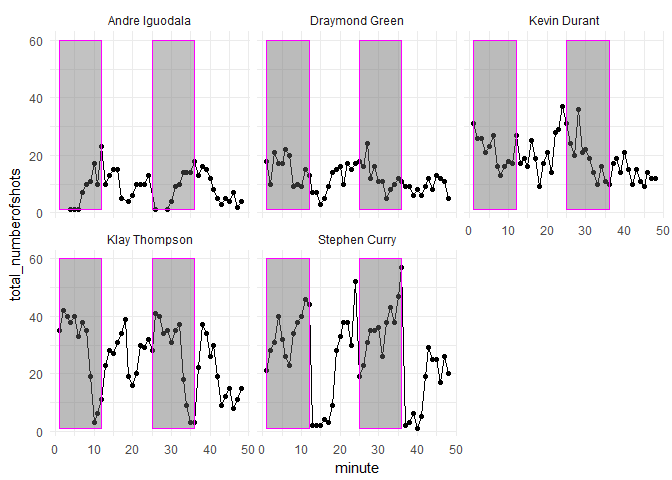

hw02 shot charts
================
Josh Seo
Mar. 5, 2018

PART 5.1
========

``` r
shots_data <- read.csv(file = "../data/shots-data.csv", stringsAsFactors = FALSE)
shots_data %>%
  filter(shot_made_flag=="made_shot" | shot_made_flag=="missed_shot") %>%
  group_by(name)%>%
  summarise(total = n()) %>% 
  ungroup() %>% 
  arrange(desc(total))
```

    ## # A tibble: 5 x 2
    ##   name           total
    ##   <chr>          <int>
    ## 1 Stephen Curry   1250
    ## 2 Klay Thompson   1220
    ## 3 Kevin Durant     915
    ## 4 Draymond Green   578
    ## 5 Andre Iguodala   371

PART 5.2: Total (2PT+3PT) effective
===================================

``` r
shots_data %>%
  filter(shot_made_flag=="made_shot" | shot_made_flag=="missed_shot") %>%
  group_by(name)%>%
  summarise(total = n()) %>% 
  ungroup() %>% 
  arrange(name) %>%
  data.frame -> data_1

shots_data %>%
  filter(shot_made_flag=="made_shot") %>%
  group_by(name)%>%
  summarise(made = n()) %>% 
  ungroup() %>% 
  arrange(name) %>%
  data.frame -> data_2


shots_data %>%
  filter(shot_made_flag=="missed_shot") %>%
  group_by(name)%>%
  summarise(missed = n()) %>% 
  ungroup() %>% 
  arrange(name) %>%
  data.frame -> data_3
perc_made <- (data_2$made/data_1$total)
cbind(data_1, select(data_2, made), perc_made) -> effective_shooting
arrange(effective_shooting, desc(perc_made))
```

    ##             name total made perc_made
    ## 1   Kevin Durant   915  495 0.5409836
    ## 2 Andre Iguodala   371  192 0.5175202
    ## 3  Klay Thompson  1220  575 0.4713115
    ## 4  Stephen Curry  1250  584 0.4672000
    ## 5 Draymond Green   578  245 0.4238754

PART 5.2: 2PT effective
=======================

``` r
shots_data %>%
  filter((shot_type=="2PT Field Goal" & shot_made_flag=="missed_shot") | (shot_type=="2PT Field Goal" & shot_made_flag=="made_shot")) %>%
  group_by(name)%>%
  summarise(total_2PT = n()) %>% 
  ungroup() %>% 
  arrange(name) %>%
  data.frame -> data_1_2pt

shots_data %>%
  filter((shot_type=="2PT Field Goal" & shot_made_flag=="made_shot")) %>%
  group_by(name)%>%
  summarise(made = n()) %>% 
  ungroup() %>% 
  arrange(name) %>%
  data.frame -> data_2_2pt

perc_made_2pt <- (data_2_2pt$made/data_1_2pt$total)
cbind(data_1_2pt, select(data_2_2pt, made), perc_made_2pt) -> effective_shooting_2pt
arrange(effective_shooting_2pt, desc(perc_made_2pt))
```

    ##             name total_2PT made perc_made_2pt
    ## 1 Andre Iguodala       210  134     0.6380952
    ## 2   Kevin Durant       643  390     0.6065319
    ## 3  Stephen Curry       563  304     0.5399645
    ## 4  Klay Thompson       640  329     0.5140625
    ## 5 Draymond Green       346  171     0.4942197

PART 5.2: 3PT effective
=======================

``` r
shots_data %>%
  filter((shot_type=="3PT Field Goal" & shot_made_flag=="missed_shot") | (shot_type=="3PT Field Goal" & shot_made_flag=="made_shot")) %>%
  group_by(name)%>%
  summarise(total_3PT = n()) %>% 
  ungroup() %>% 
  arrange(name) %>%
  data.frame -> data_1_3pt

shots_data %>%
  filter((shot_type=="3PT Field Goal" & shot_made_flag=="made_shot")) %>%
  group_by(name)%>%
  summarise(made = n()) %>% 
  ungroup() %>% 
  arrange(name) %>%
  data.frame -> data_2_3pt

perc_made_3pt <- (data_2_3pt$made/data_1_3pt$total)
cbind(data_1_3pt, select(data_2_3pt, made), perc_made_3pt) -> effective_shooting_3pt
arrange(effective_shooting_3pt, desc(perc_made_3pt))
```

    ##             name total_3PT made perc_made_3pt
    ## 1  Klay Thompson       580  246     0.4241379
    ## 2  Stephen Curry       687  280     0.4075691
    ## 3   Kevin Durant       272  105     0.3860294
    ## 4 Andre Iguodala       161   58     0.3602484
    ## 5 Draymond Green       232   74     0.3189655

Part 6.1
========

``` r
    shots_data %>%
      group_by(shot_distance) %>%
      select(shot_distance, shot_made_flag) %>%
      summarise(
        made_shot_prop = (sum(shot_made_flag == 'made_shot'))/(sum(shot_made_flag == 'made_shot'|shot_made_flag == 'missed_shot')))
```

    ## # A tibble: 56 x 2
    ##    shot_distance made_shot_prop
    ##            <int>          <dbl>
    ##  1             0          0.841
    ##  2             1          0.668
    ##  3             2          0.534
    ##  4             3          0.373
    ##  5             4          0.411
    ##  6             5          0.286
    ##  7             6          0.396
    ##  8             7          0.395
    ##  9             8          0.463
    ## 10             9          0.321
    ## # ... with 46 more rows

Part 6.2
========

``` r
shot_distance_table <- data.frame(
      shots_data %>%
      group_by(shot_distance) %>%
      select(shot_distance, shot_made_flag) %>%
      summarise(made_shot_prop = 
                  (sum(shot_made_flag == 'made_shot'))/
                  (sum(shot_made_flag == 'made_shot'|shot_made_flag == 'missed_shot'))
                )
)
    
ggplot(shot_distance_table, aes(x=shot_distance, y=made_shot_prop)) + geom_point(size=4, shape=20)
```



``` r
shot_distance_table$shot_distance[shot_distance_table$made_shot_prop >= 0.50]
```

    ## [1]  0  1  2 12 16 18 21 30 51

Part 7
======

``` r
part7 <- data.frame(
  shots_data %>%
    group_by(minute, name) %>%
    select(name, minute, shot_made_flag) %>%
    summarise(total_numberofshots = sum(shot_made_flag == "made_shot"|shot_made_flag=="missed_shot"))
)

ggplot(part7, aes(x = minute, y = total_numberofshots)) +
  geom_point() +
  geom_path() +
  geom_rect(aes(xmin = 1, xmax = 12, ymin = 1, ymax = 60), color="magenta", alpha = 0.01) +
  geom_rect(aes(xmin = 25, xmax = 36, ymin = 1, ymax = 60), color="magenta", alpha = 0.01) +
  scale_x_continuous() +
  theme_minimal() +
  facet_wrap(~name)
```


